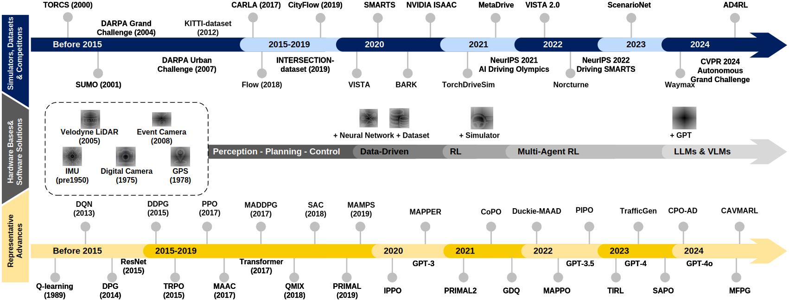

# MARL for Autonomous Driving

Hi there, welcome to our repository.  
Here is all you need to learn the **Multi-Agent Reinforcement Learning (MARL) for Autonomous Driving**.  
For a more comprehensive survey, please look at:
> [**Multi-Agent Reinforcement Learning for Autonomous Driving: A Survey**](https://arxiv.org/abs/2408.09675)  
> [Ruiqi Zhang<sup>1,2</sup>](https://ruiqizhang99.github.io), [Jing Hou<sup>1</sup>](https://scholar.google.com/citations?user=8mO6YIMAAAAJ), [Florian Walter<sup>3</sup>](https://scholar.google.com/citations?user=Z3QCbaUAAAAJ), [Shangding Gu<sup>2,4</sup>](https://scholar.google.com/citations?user=E1GCDXUAAAAJ), [Jiayi Guan<sup>1</sup>](https://scholar.google.com/citations?user=PbNNo9cAAAAJ), [Florian Röhrbein<sup>5</sup>](https://scholar.google.com/citations?user=IEOJBbAAAAAJ), [Yali Du<sup>6</sup>](https://scholar.google.com/citations?user=WMlPkOoAAAAJ), [Panpan Cai<sup>7</sup>](https://cindycia.github.io/), [Guang Chen<sup>1,4,*</sup>](https://ispc-group.github.io/), [Alois Knoll<sup>4</sup>](https://scholar.google.com/citations?user=-CA8QgwAAAAJ)  
> <sup>1</sup>Tongji University; <sup>2</sup>University of California, Berkeley; <sup>3</sup>University of Technology Nuremberg; <sup>4</sup>Technical University of Munich; <sup>5</sup>Chemnitz University of Technology; <sup>6</sup>King's College London; <sup>7</sup>Shanghai Jiao Tong University


## 0 Glance at the History


We have summarized the following over the past decades: (1) autonomous driving simulators, datasets, and competitions; (2) development trends in hardware and software; (3) single-agent and multi-agent reinforcement learning and related algorithms.

## 1 Open-Access Learning Materials
**Books**
> [Reinforcement Learning: An Introduction](https://web.stanford.edu/class/psych209/Readings/SuttonBartoIPRLBook2ndEd.pdf) (by Richard Sutton et. al, MIT press)  
> [Reinforcement Learning for Sequential Decision and Optimal Control](https://link.springer.com/book/10.1007/978-981-19-7784-8) (by Shengbo Eben Li, Springer)  
> [Autonomous Driving (Technical, Legal and Social Aspects)](https://link.springer.com/book/10.1007/978-3-662-48847-8) (by Markus Maurer et. al, Springer)  


**Courses** 
> [UC Berkeley, CS285: Introduction to Reinforcement Learning](https://www.youtube.com/watch?v=SupFHGbytvA&list=PL_iWQOsE6TfVYGEGiAOMaOzzv41Jfm_Ps) (by Sergey Levine)  
> [Stanford, CS 234: Reinforcement Learning](https://www.youtube.com/watch?v=FgzM3zpZ55o&list=PLoROMvodv4rOSOPzutgyCTapiGlY2Nd8u) (by Emma Brunskill)  
> [Introduction to Reinforcement Learning (Chinese Version)](https://www.youtube.com/watch?v=IkEF4LpH5Ys&list=PLySQw_vQ73PyDY68KF0HdCzcILBoHVTvD) (by Bolei Zhou)  
> [Multi-Agent Artificial Intelligence [Bilibili]](https://www.bilibili.com/video/BV1fz4y1S72S?p=1&vd_source=cd04812e2c6ae50416c20981d08acf0a) (by Jun Wang)  
> [Self-Driving Cars [Course Syllabus]](https://uni-tuebingen.de/en/fakultaeten/mathematisch-naturwissenschaftliche-fakultaet/fachbereiche/informatik/lehrstuehle/autonomous-vision/lectures/self-driving-cars/) [[Video]](https://www.youtube.com/watch?v=_q4WUxgwDeg&list=PL05umP7R6ij321zzKXK6XCQXAaaYjQbzr) (by Andreas Geiger)  

**Talks**
> [MicroSoft Reinforcement Learning Day: Multi-Agent Reinforcement Learning](https://www.youtube.com/watch?v=Yd6HNZnqjis&list=PLNZMKGYv14qLCMfRuOJOrvgcKrqyPk6eB)  
> [Berkeley Simons Institute: Multi-Agent Reinforcement Learning [Part I]](https://www.youtube.com/watch?v=RCu-nU4_TQM&t=5s)[[Part II]](https://www.youtube.com/watch?v=RWBF9gG2uz0&t=30s)  
> [Safe Reinforcement Learning via Statistical Model Predictive Shielding, RSS 2021](https://www.youtube.com/watch?v=_czP3eqTjaY)  
> [Safety in Reinforcement Learning by Leveraging Offline Data, IEEE MFI 2022](https://www.youtube.com/watch?v=uvXb0P1knRw)  
> [Learning Robust Policies for Self-Driving, ECCV 2022](https://www.youtube.com/watch?v=rm-1sPQV4zg)  


## 2 Benchmarks
### 2.1 Simulators

**TrafficFlow Oriented**
| Simulator | Released Time | Paper | Other Supplyments | Affiliation |
|-----------|---------------|-------|-------------------|-------------|
|[**SUMO**](https://eclipse.dev/sumo/)| 2001 | [Preprint](https://elib.dlr.de/6661/2/dkrajzew_MESM2002.pdf) | - | openMobility
|[**Flow**](https://flow-project.github.io) | 2018 |[T-RO](https://ieeexplore.ieee.org/document/9489303)|[Documentation](https://flow-project.github.io/tutorial.html)| UC Berkeley
|[**Highway-env**](https://github.com/Farama-Foundation/HighwayEnv)| 2018 | - |[Documentation](https://highway-env.farama.org/) |Farama FD. 
|[**CityFlow**](https://github.com/cityflow-project/CityFlow/)| 2019 | [WWW](https://arxiv.org/abs/1905.05217) |[Documentation](https://cityflow-project.github.io/index.html)| UC Berkeley
|[**BARK**](https://github.com/bark-simulator/bark)| 2020 | [IROS](https://ieeexplore.ieee.org/abstract/document/9341222)|[Documentation](https://bark-simulator.github.io/tutorials/) | fortiss
|[**MADRaS**](https://github.com/madras-simulator/MADRaS) | 2020 | - |[Documentation](https://github.com/madras-simulator/MADRaS/wiki) | - |
|[**SMARTS**](https://github.com/huawei-noah/SMARTS)| 2020 | [CoRL](https://proceedings.mlr.press/v155/zhou21a.html) | [Documentation](https://smarts.readthedocs.io/en/latest/) | Noah's Ark Lab |
|[**MetaDrive**](https://github.com/metadriverse/metadrive)| 2021 |[T-PAMI](https://ieeexplore.ieee.org/abstract/document/9829243) | [Documentation](https://metadrive-simulator.readthedocs.io/en/latest/) | UCLA 
|[**TBSim**](https://github.com/NVlabs/traffic-behavior-simulation) | 2021 | [ICRA](https://ieeexplore.ieee.org/abstract/document/10161167) | [Pretrained Model](https://drive.google.com/drive/folders/1y3_HO1c721pFrFOYeGGjORV58g6zNEds) | NVIDIA Research
|[**TorchDriveSim**](https://github.com/inverted-ai/torchdrivesim)|  2021 | [ITSC](https://ieeexplore.ieee.org/document/9565113) | - | Inverted AI
|[**InterSim**](https://github.com/Tsinghua-MARS-Lab/InterSim) | 2022 | [IROS](https://ieeexplore.ieee.org/abstract/document/9982008) | - | Tsinghua University
|[**Nocturne**](https://github.com/facebookresearch/nocturne) | 2022 | [NeurIPS](https://papers.nips.cc/paper_files/paper/2022/hash/191e9e721a2748a860714fb23aaf7c5d-Abstract-Datasets_and_Benchmarks.html) | - | Meta
|[**ScenarioNet**](https://github.com/metadriverse/scenarionet)| 2024 | [NeurIPS](https://proceedings.neurips.cc/paper_files/paper/2023/hash/0c26a501df8fb919a0350e2df06b5d39-Abstract-Datasets_and_Benchmarks.html) | [Documentation](https://scenarionet.readthedocs.io/en/latest/operations.html) |UCLA
|[**Waymax**](https://github.com/waymo-research/waymax)| 2024 | [NeurIPS](https://openreview.net/pdf?id=7VSBaP2OXN) | [Documentation](https://waymo-research.github.io/waymax/docs/) | Waymo Research

**Fidelity Oriented**
| Simulator | Released Time | Paper | Other Supplyments | Affiliation |
|-----------|---------------|-------|-------------------|-------------|
|[**TORCS**](https://sourceforge.net/projects/torcs/)| 2000 | - | - | SourceForge
|[**Gym-TORCS**](https://github.com/ugo-nama-kun/gym_torcs)| 2017 | [ArXiv](https://arxiv.org/pdf/1304.1672) | - | UTokyo
|[**CARLA**](https://github.com/carla-simulator/carla)| 2017 | [CoRL](https://proceedings.mlr.press/v78/dosovitskiy17a.html) | [Documentation](https://carla.readthedocs.io/en/latest/)| Intel Lab
|[**MACAD**](https://github.com/praveen-palanisamy/macad-gym)| 2020 | [IJCNN](https://ieeexplore.ieee.org/stamp/stamp.jsp?tp=&arnumber=9207663)| - | MicroSoft Research
|[**ISAAC Sim**](https://developer.nvidia.com/isaac/sim) | 2020 | - | [Documentation](https://docs.omniverse.nvidia.com/isaacsim/latest/installation/index.html) | NVIDIA Research
|[**Vista**](https://github.com/vista-simulator/vista) | 2020 |  [RA-L](https://ieeexplore.ieee.org/abstract/document/8957584) /[ICRA](https://ieeexplore.ieee.org/stamp/stamp.jsp?tp=&arnumber=9812276) | [Documentation](https://vista.csail.mit.edu/) | MIT CSAIL
|[**ISAAC Lab**](https://github.com/isaac-sim/IsaacLab) | 2024 | [RA-L](https://ieeexplore.ieee.org/abstract/document/10107764) | [Documentation](https://isaac-sim.github.io/IsaacLab/index.html)| NVIDIA Research


### 2.2 Datasets
| Simulator | Released Time | Affiliation |
|-----------|---------------|-------------|
|[**KITTI**](https://www.cvlibs.net/datasets/kitti/)| 2013 | KIT |
|[**Visual KITTI**](https://europe.naverlabs.com/research/computer-vision/proxy-virtual-worlds-vkitti-1/)| 2016 | Naver Lab |
|[**INTERACTION Dataset**](https://interaction-dataset.com/)| 2019 | UC Berkeley |
|[**Visual KITTI 2**](https://europe.naverlabs.com/research/computer-vision/proxy-virtual-worlds-vkitti-2/)| 2020 | Naver Lab |
|[**KITTI 360**](https://www.cvlibs.net/datasets/kitti-360/)| 2021 | KIT |
|[**nuScenes**](https://www.nuscenes.org/) | - | Motional |
|[**nuPlan**](https://www.nuscenes.org/nuplan) | - | Motional |
|[**Waymo Open Dataset**](https://waymo.com/open/) | - |  Waymo |
|[**Lyft LV5**](https://github.com/cognitive-robots/lyft_prediction_dataset_tools) | - | Lyft |


## 3. Methodologies
### 3.1 Fundamental Algorithm
**Model-Free RL**
| Algorithm | Released Time | Paper | Implementation | Affiliation |
|-----------|---------------|-------|----------------|-------------|
| **Deep Q-Network** | 2013 | [Preprint](https://people.engr.tamu.edu/guni/csce642/files/dqn.pdf)  | [SB3](https://github.com/DLR-RM/stable-baselines3/tree/master/stable_baselines3/dqn), [Official](https://github.com/google-deepmind/dqn) | DeepMind |
| **DDPG** | 2015 | [ICML](https://proceedings.mlr.press/v32/lillicrap15.pdf) | [SB3](https://github.com/DLR-RM/stable-baselines3/tree/master/stable_baselines3/ddpg)| DeepMind |
| **Double DQN** | 2015 | [AAAI](https://arxiv.org/abs/1509.06461) | [SB3](https://github.com/DLR-RM/stable-baselines3)| DeepMind |
| **Dueling DQN**| 2016 | [ArXiv](https://arxiv.org/abs/1511.06581)| [SB3](https://github.com/DLR-RM/stable-baselines3)| DeepMind |
| **REINFORCE**  | 1992 | [Machine Learning](https://link.springer.com/article/10.1007/bf00992696) | [Official](https://github.com/rlcode/reinforcement-learning)| Northeastern University     |
| **TRPO** | 2015 | [ICML](https://proceedings.mlr.press/v37/schulman15.pdf) | [SpinUp](https://github.com/openai/spinningup/tree/master/spinup/algos/pytorch/trpo)| UC Berkeley |
| **A2C**  | 2016 | [ICML](https://proceedings.mlr.press/v48/mniha16.pdf)| [SB3](https://github.com/DLR-RM/stable-baselines3)| DeepMind |
| **PPO** | 2017 | [ArXiv](https://arxiv.org/abs/1707.06347)| [SB3](https://github.com/DLR-RM/stable-baselines3/tree/master/stable_baselines3/ppo)| OpenAI |
| **TD3** | 2018 | [ICML](https://proceedings.mlr.press/v80/fujimoto18a.html)| [SB3](https://github.com/DLR-RM/stable-baselines3/tree/master/stable_baselines3/td3)| McGill University |
| **SAC** | 2018 | [ICML](https://proceedings.mlr.press/v80/haarnoja18b.html)| [SB3](https://github.com/DLR-RM/stable-baselines3/tree/master/stable_baselines3/sac)| UC Berkeley |


**Model-based RL**
| Algorithm | Released Time | Paper | Implementation | Affiliation |
|-----------|---------------|-------|----------------|-------------|
| **MBPO**  | 2019 | [NeurIPS](https://proceedings.neurips.cc/paper_files/paper/2019/file/5faf461eff3099671ad63c6f3f094f7f-Paper.pdf) | [Official](https://github.com/JannerM/mbpo) | UC Berkeley |
| **PlaNet** | 2019 | [ICML](https://proceedings.mlr.press/v97/hafner19a.html)| [Official](https://github.com/google-research/planet)| Google |
| **Dreamer v1** | 2020 | [ICLR](https://openreview.net/forum?id=S1lOTC4tDS)| [Official](https://github.com/danijar/dreamer) | Google |
| **Dreamer v2** | 2021 | [ICLR](https://arxiv.org/pdf/2010.02193)| [Official](https://github.com/danijar/dreamer)| Google |
| **Dreamer v3** | 2023 | [ArXiv](https://arxiv.org/abs/2301.04104)| [Official](https://github.com/danijar/dreamerv3)| DeepMind |

**Multi-Agent RL**
### 3.2 Multi-Agent Reinforcement Learning (MARL) Algorithms
| Algorithm | Released Time | Paper | Implementation | Affiliation |
|-----------|---------------|-------|----------------|-------------|
| **IQL**| 2015 | [ArXiv](https://arxiv.org/pdf/1511.08779) | [Pymarl](https://arxiv.org/pdf/1511.08779) | University of Tartu |
| **VDN**| 2017 | [ArXiv](https://arxiv.org/pdf/1706.05296)| [Pymarl](https://github.com/oxwhirl/pymarl)| DeepMind |
| **MADDPG**| 2017 | [NeurIPS](https://proceedings.neurips.cc/paper/2017/file/68a9750337a418a86fe06c1991a1d64c-Paper.pdf) | [Official](https://github.com/openai/maddpg)| OpenAI, UC Berkeley|
| **COMA**| 2017 | [AAAI](https://ojs.aaai.org/index.php/AAAI/article/view/11794)| [Pymarl](https://github.com/oxwhirl/pymarl) | University of Oxford |
| **QMIX**| 2018 | [ICML](https://proceedings.mlr.press/v80/rashid18a.html)| [Pymarl](https://github.com/oxwhirl/pymarl) | University of Oxford |
| **QTRAN**| 2019 | [ICML](https://proceedings.mlr.press/v97/son19a.html)| [Pymarl](https://github.com/oxwhirl/pymarl) | KAIST |
| **IPPO** | 2019 | [ArXiv](https://arxiv.org/abs/2011.09533)| [epymarl](https://github.com/uoe-agents/epymarl) | University of Oxford |
| **AlphaStar**| 2019 | [Nature](https://www.nature.com/articles/s41586-019-1724-z)| [Official](https://github.com/google-deepmind/alphastar) | DeepMind | 
| **MAPPO** | 2021 | [NeurIPS](https://papers.nips.cc/paper_files/paper/2022/hash/9c1535a02f0ce079433344e14d910597-Abstract-Datasets_and_Benchmarks.html)| [Official](https://github.com/zoeyuchao/mappo) | Tsinghua, UC Berkeley|

-----------
*UPDATE IS STILL ON THE WAY (after Sep.15, 2024)*

### 3.3 CTDE MARL for Autonomous Driving


### 3.4 Decentralied MARL for Autonomous Driving


### 3.5 MARL with Social Preference


### 3.6 Trust-worthy and Safe MARL


## Citation
If this repository or our paper is useful for your research and would like to cite it, here is our bibtex.
```
@article{zhang2024multi,
  title={Multi-Agent Reinforcement Learning for Autonomous Driving: A Survey},
  author={Zhang, Ruiqi and Hou, Jing and Walter, Florian and Gu, Shangding and Guan, Jiayi and R{\"o}hrbein, Florian and Du, Yali and Cai, Panpan and Chen, Guang and Knoll, Alois},
  journal={arXiv preprint arXiv:2408.09675},
  year={2024}
}
```

## Contact
If you have any questions or good supplyments for the advanced research, talk, or any form of relevant materials, please contact us and we appreciate for your contribute.
- **Email** ``1854136@tongji.edu.cn``(primary), and cc to ``richzhang@berkeley.edu``, ``guangchen@tongji.edu.cn``, ``guang@in.tum.de``
- **Github issues** We would appreciate it if you reported any factual, technical and copyright issue you found in this repository.
